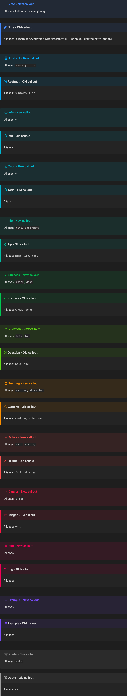

  <h1> 
   
    Old Callouts for Obsidian
  </h1>

# Description

Bring back the original style for Obsidian callouts!

# Features

Do it how you like it.

You can either replace the new ones to the old ones, or just ad the old ones as extra callouts!

# How to use:

## 1. As an extra option:

Simply copy the `old-callouts-extra.css` file in the .obsidian/snippets folder in your Vault and go under settings -> Appearance -> CSS snippets and activate the snipped

## 2. Replace default callouts

do exact the same but with the file: `old-callouts.css`

# Showcase

  

  < / > with 💛 by Lucas Gruber

